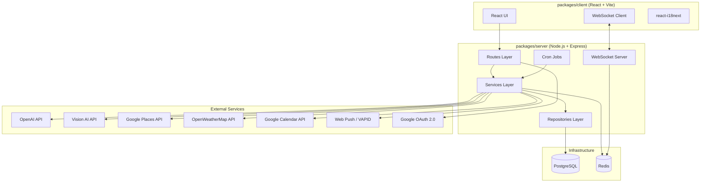

# Design Document — ShowUp2Move

## Overview

ShowUp2Move is a smart social sports-matching platform built as a hackathon prototype. The core value proposition is frictionless spontaneous sports coordination: a user taps "Yes" once per day, the platform handles everything else — finding compatible players nearby, forming a group, assigning a captain, suggesting venues, and facilitating real-time coordination through group chat.

The system is a full-stack TypeScript web application with a React frontend, a Node.js/Express backend, PostgreSQL for persistence, Redis for pub/sub and session caching, and WebSocket for real-time communication. AI enrichment (NLP + vision) augments profile data to improve match quality.

### Key Design Goals

- **Frictionless UX**: Minimize user effort at every step — single-tap availability, automatic matching, AI-assisted profile enrichment.
- **Real-time first**: Group chat, match notifications, and poll tallies must feel instant.
- **Clean architecture**: Three-layer separation (presentation → business logic → data access) for maintainability and testability.
- **AI-augmented matching**: Compatibility scores derived from NLP and vision AI improve group quality beyond simple preference matching.
- **Hackathon pragmatism**: Prioritize working end-to-end flows over exhaustive edge-case handling; use managed services where possible.

---

## Architecture

The system follows a **monorepo structure** with two packages: `packages/client` (React + Vite) and `packages/server` (Node.js + Express). The server is organized into three layers:

```
packages/server/
  routes/          ← Presentation layer: HTTP handlers, request validation, response shaping
  services/        ← Business logic layer: matching engine, AI enrichment, notifications
  repositories/    ← Data access layer: SQL queries, Redis operations
```

### High-Level Architecture Diagram



### Request Flow

1. React client sends HTTP requests to Express routes.
2. Route handlers validate input and delegate to service layer.
3. Services execute business logic, call repositories for data, and invoke external APIs.
4. Repositories execute parameterized SQL queries against PostgreSQL or read/write Redis.
5. Real-time events (chat messages, match notifications) are published to Redis pub/sub and broadcast to connected WebSocket clients.

### Cron Jobs

| Job | Schedule | Responsibility |
|-----|----------|----------------|
| Availability Prompt Dispatch | 08:00 local (configurable) | Send daily "ShowUpToday?" notifications |
| Follow-up Reminder | 2h after prompt | Remind non-responders |
| Matching Engine Run | Configurable (after response window) | Group available users, finalize groups |
| Confirmation Deadline | 30 min after group finalization | Remove non-confirmers, attempt re-fill |
| Captain Reminder | 2h after captain assignment | Remind idle captains |
| Weather Refresh | Every 3h | Refresh forecasts for events within 48h |
| Achievement Evaluator | After each event attendance | Grant newly earned achievements |

---

## Components and Interfaces

### Auth Service

Handles registration, login, OAuth, session management, and password reset.

```typescript
interface AuthService {
  register(email: string, password: string): Promise<{ userId: string; token: string }>;
  login(email: string, password: string): Promise<{ token: string }>;
  loginWithOAuth(provider: 'google', code: string): Promise<{ token: string; isNew: boolean }>;
  requestPasswordReset(email: string): Promise<void>;
  confirmPasswordReset(token: string, newPassword: string): Promise<void>;
  validateToken(token: string): Promise<{ userId: string }>;
}
```

JWT tokens are signed with a secret from environment variables, expire after 7 days, and are validated by `authenticateToken` middleware on all protected routes. Passwords are hashed with bcrypt at cost factor ≥ 12. Password reset tokens are stored in Redis with a 1-hour TTL.

### Profile Service

Manages user profiles, sports preferences, skill levels, and photo uploads.

```typescript
interface ProfileService {
  createProfile(userId: string, data: ProfileInput): Promise<Profile>;
  updateProfile(userId: string, data: Partial<ProfileInput>): Promise<Profile>;
  getProfile(userId: string): Promise<Profile>;
  uploadPhoto(userId: string, file: Buffer, mimeType: string): Promise<{ url: string; thumbnailUrl: string }>;
  updateSports(userId: string, sports: Array<{ sportId: string; skillLevel?: SkillLevel }>): Promise<void>;
  isComplete(profile: Profile): boolean; // display name + ≥1 sport
}

type SkillLevel = 'Beginner' | 'Intermediate' | 'Advanced';

interface Profile {
  userId: string;
  displayName: string;
  bio: string; // max 300 chars
  photoUrl?: string;
  thumbnailUrl?: string;
  sports: Array<{ sport: Sport; skillLevel?: SkillLevel }>;
  isComplete: boolean;
  achievements: Achievement[];
}
```

Photo uploads are validated for MIME type (JPEG/PNG/WebP) and size (≤ 5 MB) before processing. Thumbnails are resized to 200×200px using Sharp or equivalent.

### AI Enrichment Service

Extracts sport interests from bio text (NLP) and profile photos (vision AI), and computes compatibility scores.

```typescript
interface AIEnrichmentService {
  suggestSportsFromBio(bio: string): Promise<SportSuggestion[]>;
  suggestSportsFromPhoto(imageBuffer: Buffer): Promise<SportSuggestion[]>;
  computeCompatibilityScore(userA: Profile, userB: Profile, sport: Sport): Promise<number>; // [0.0, 1.0]
}

interface SportSuggestion {
  sportId: string;
  confidence: number;
  source: 'bio' | 'photo';
}
```

NLP analysis must complete within 5 seconds; vision AI within 10 seconds. Both are fire-and-forget relative to the profile save — the profile is saved immediately and suggestions are surfaced asynchronously. Compatibility scores are symmetric: `score(A, B) == score(B, A)`.

### Availability Service

Records daily availability responses and manages the availability lifecycle.

```typescript
interface AvailabilityService {
  recordResponse(userId: string, available: boolean, sportIds?: string[]): Promise<AvailabilityResponse>;
  updateResponse(responseId: string, available: boolean, sportIds?: string[]): Promise<AvailabilityResponse>;
  getTodayResponse(userId: string): Promise<AvailabilityResponse | null>;
  getAvailableUsers(date: Date, sportId?: string): Promise<string[]>; // userIds
  lockResponsesForMatching(date: Date): Promise<void>; // prevents further changes
}

interface AvailabilityResponse {
  id: string;
  userId: string;
  date: string; // YYYY-MM-DD
  available: boolean;
  sportIds: string[]; // empty = all preferred sports
  lockedForMatching: boolean;
  createdAt: Date;
  updatedAt: Date;
}
```

### Matching Engine

Core algorithm that groups available users into sport-appropriate groups.

```typescript
interface MatchingEngine {
  runMatchingCycle(date: Date): Promise<Group[]>;
  finalizeGroup(groupId: string): Promise<void>;
  fillVacancy(groupId: string): Promise<boolean>;
  dissolveGroup(groupId: string): Promise<void>;
  balanceTeams(groupId: string): Promise<TeamAssignment>;
}

interface Group {
  id: string;
  sport: Sport;
  members: GroupMember[];
  state: 'Pending' | 'Active' | 'Dissolved';
  captainUserId?: string;
  teamAssignment?: TeamAssignment;
  createdAt: Date;
}

interface TeamAssignment {
  teamA: string[]; // userIds
  teamB: string[]; // userIds
}
```

**Matching Algorithm (pseudocode):**
```
for each sport with available users:
  sort users by mutual compatibility score (descending)
  apply proximity filter (default 10 km radius)
  greedily fill groups to max_size
  if group.size >= min_size: finalize group
  else: queue users for next cycle
```

Team balancing for team sports distributes members such that `|avg_skill(teamA) - avg_skill(teamB)| ≤ 1 tier`.

### Group Chat Service

Real-time messaging for matched groups.

```typescript
interface GroupChatService {
  createChat(groupId: string, memberIds: string[]): Promise<Chat>;
  sendMessage(groupId: string, senderId: string, content: string): Promise<Message>;
  getMessages(groupId: string, cursor?: string, limit?: number): Promise<Message[]>;
  addMember(groupId: string, userId: string): Promise<void>;
  removeMember(groupId: string, userId: string): Promise<void>;
  createPoll(groupId: string, creatorId: string, question: string, options: string[], durationMinutes: number): Promise<Poll>;
  castVote(pollId: string, userId: string, optionId: string): Promise<void>;
}
```

Messages are broadcast via WebSocket rooms keyed by `group:{groupId}`. Redis pub/sub fans out messages across server instances. Message history is retained for event duration + 24 hours.

### Notification Service

Delivers push notifications and in-app alerts.

```typescript
interface NotificationService {
  sendPush(userId: string, payload: NotificationPayload): Promise<void>;
  sendInApp(userId: string, payload: NotificationPayload): Promise<void>;
  broadcastToGroup(groupId: string, payload: NotificationPayload): Promise<void>;
  getUserPreferences(userId: string): Promise<NotificationPreferences>;
  updatePreferences(userId: string, prefs: Partial<NotificationPreferences>): Promise<void>;
}

interface NotificationPayload {
  type: NotificationType;
  title: string;
  body: string;
  deepLink: string;
  data?: Record<string, unknown>;
}

type NotificationType =
  | 'availability_prompt'
  | 'match_found'
  | 'match_confirmation'
  | 'captain_assigned'
  | 'new_message'
  | 'poll_result'
  | 'event_reminder'
  | 'achievement_unlocked'
  | 'weather_alert';
```

Push notifications use the Web Push API (VAPID). In-app notifications are delivered via WebSocket. All notifications include deep links. Delivery SLA: ≤ 5 seconds for general notifications, ≤ 2 seconds for new chat messages.

### Location Service

Resolves user coordinates and queries nearby venues.

```typescript
interface LocationService {
  getNearbyVenues(sport: Sport, lat: number, lng: number, radiusKm: number): Promise<Venue[]>;
  expandSearch(sport: Sport, lat: number, lng: number, maxExpansions?: number): Promise<Venue[]>;
  getNearbyEvents(lat: number, lng: number, radiusKm: number): Promise<Event[]>;
}

interface Venue {
  id: string;
  name: string;
  address: string;
  lat: number;
  lng: number;
  distanceKm: number;
  pricing?: string;
}
```

If no venues are found within the initial radius, the service expands by 5 km increments up to 3 times.

### Weather Service

```typescript
interface WeatherService {
  getForecast(lat: number, lng: number, datetime: Date): Promise<WeatherForecast>;
  hasAdvisory(forecast: WeatherForecast): boolean; // rain | heat > 35°C | wind > 50 km/h
}
```

### Calendar Service

```typescript
interface CalendarService {
  addEvent(userId: string, event: Event, provider: 'google' | 'apple'): Promise<{ entryId: string }>;
  updateEvent(userId: string, entryId: string, event: Event): Promise<void>;
  generateICS(event: Event): string;
}
```

### Achievement Service

```typescript
interface AchievementService {
  evaluateAchievements(userId: string): Promise<Achievement[]>; // returns newly granted
  getLeaderboard(sportId?: string): Promise<LeaderboardEntry[]>;
}
```

---

## Data Models

### Entity Relationship Diagram

```mermaid
erDiagram
    USERS {
        uuid id PK
        string email UK
        string password_hash
        string oauth_provider
        string oauth_id
        timestamp created_at
    }

    PROFILES {
        uuid id PK
        uuid user_id FK
        string display_name
        string bio
        string photo_url
        string thumbnail_url
        boolean is_complete
        timestamp updated_at
    }

    SPORTS {
        uuid id PK
        string name UK
        int min_group_size
        int max_group_size
        boolean is_team_sport
    }

    USER_SPORTS {
        uuid id PK
        uuid user_id FK
        uuid sport_id FK
        string skill_level
    }

    AVAILABILITY_RESPONSES {
        uuid id PK
        uuid user_id FK
        date date
        boolean available
        boolean locked_for_matching
        timestamp created_at
        timestamp updated_at
    }

    AVAILABILITY_SPORT_SELECTIONS {
        uuid id PK
        uuid availability_response_id FK
        uuid sport_id FK
    }

    GROUPS {
        uuid id PK
        uuid sport_id FK
        string state
        uuid captain_user_id FK
        timestamp created_at
    }

    GROUP_MEMBERS {
        uuid id PK
        uuid group_id FK
        uuid user_id FK
        string confirmation_status
        string team
        timestamp confirmed_at
    }

    EVENTS {
        uuid id PK
        uuid group_id FK
        uuid sport_id FK
        uuid captain_user_id FK
        string title
        string description
        string venue_name
        string venue_address
        float venue_lat
        float venue_lng
        timestamp start_time
        timestamp end_time
        int min_participants
        int max_participants
        boolean is_public
        string state
        timestamp created_at
    }

    EVENT_PARTICIPANTS {
        uuid id PK
        uuid event_id FK
        uuid user_id FK
        string status
        timestamp responded_at
    }

    MESSAGES {
        uuid id PK
        uuid group_id FK
        uuid sender_id FK
        string content
        string message_type
        timestamp created_at
        timestamp expires_at
    }

    POLLS {
        uuid id PK
        uuid group_id FK
        uuid creator_id FK
        string question
        timestamp closes_at
        boolean is_closed
    }

    POLL_OPTIONS {
        uuid id PK
        uuid poll_id FK
        string label
    }

    POLL_VOTES {
        uuid id PK
        uuid poll_id FK
        uuid option_id FK
        uuid user_id FK
        timestamp voted_at
    }

    AI_SUGGESTIONS {
        uuid id PK
        uuid user_id FK
        uuid sport_id FK
        string source
        float confidence
        string status
        timestamp created_at
    }

    COMPATIBILITY_SCORES {
        uuid id PK
        uuid user_a_id FK
        uuid user_b_id FK
        uuid sport_id FK
        float score
        timestamp computed_at
    }

    ACHIEVEMENTS {
        uuid id PK
        string key UK
        string title
        string description
        string icon_url
    }

    USER_ACHIEVEMENTS {
        uuid id PK
        uuid user_id FK
        uuid achievement_id FK
        timestamp granted_at
    }

    NOTIFICATIONS {
        uuid id PK
        uuid user_id FK
        string type
        string title
        string body
        string deep_link
        boolean is_read
        timestamp created_at
    }

    PUSH_SUBSCRIPTIONS {
        uuid id PK
        uuid user_id FK
        string endpoint
        string p256dh
        string auth
        timestamp created_at
    }

    USERS ||--o| PROFILES : has
    USERS ||--o{ USER_SPORTS : has
    SPORTS ||--o{ USER_SPORTS : categorizes
    USERS ||--o{ AVAILABILITY_RESPONSES : submits
    AVAILABILITY_RESPONSES ||--o{ AVAILABILITY_SPORT_SELECTIONS : scopes
    GROUPS ||--o{ GROUP_MEMBERS : contains
    USERS ||--o{ GROUP_MEMBERS : joins
    SPORTS ||--o{ GROUPS : typed_by
    GROUPS ||--o| EVENTS : produces
    EVENTS ||--o{ EVENT_PARTICIPANTS : has
    GROUPS ||--o{ MESSAGES : hosts
    GROUPS ||--o{ POLLS : contains
    POLLS ||--o{ POLL_OPTIONS : has
    POLLS ||--o{ POLL_VOTES : receives
    USERS ||--o{ AI_SUGGESTIONS : receives
    USERS ||--o{ COMPATIBILITY_SCORES : scored_in
    USERS ||--o{ USER_ACHIEVEMENTS : earns
    ACHIEVEMENTS ||--o{ USER_ACHIEVEMENTS : granted_via
    USERS ||--o{ NOTIFICATIONS : receives
    USERS ||--o{ PUSH_SUBSCRIPTIONS : registers
```



### Key Schema Constraints

- `sports.min_group_size <= sports.max_group_size` (enforced by CHECK constraint)
- `user_sports.skill_level` is an enum: `('Beginner', 'Intermediate', 'Advanced')` or NULL
- `availability_responses` has a UNIQUE constraint on `(user_id, date)` — one response per user per day
- `poll_votes` has a UNIQUE constraint on `(poll_id, user_id)` — one vote per user per poll
- `compatibility_scores` has a UNIQUE constraint on `(user_a_id, user_b_id, sport_id)` where `user_a_id < user_b_id` (canonical ordering for symmetry)
- `messages.expires_at` is set to `event.end_time + 24 hours` at message creation time
- `groups.state` is an enum: `('Pending', 'Active', 'Dissolved')`
- `group_members.confirmation_status` is an enum: `('Pending', 'Confirmed', 'Declined')`

### Sports Seed Data

| Sport | Min | Max | Team Sport |
|-------|-----|-----|------------|
| Football | 10 | 14 | true |
| Basketball | 6 | 10 | true |
| Tennis | 2 | 4 | false |
| Volleyball | 6 | 12 | true |
| Badminton | 2 | 4 | false |
| Running | 2 | 20 | false |
| Cycling | 2 | 20 | false |
| Swimming | 2 | 10 | false |
| Table Tennis | 2 | 4 | false |
| Rugby | 10 | 16 | true |

---

## Correctness Properties

*A property is a characteristic or behavior that should hold true across all valid executions of a system — essentially, a formal statement about what the system should do. Properties serve as the bridge between human-readable specifications and machine-verifiable correctness guarantees.*

### Property 1: Group size invariant

*For any* finalized group, the number of confirmed members must be at least `sport.min_group_size` and at most `sport.max_group_size`.

**Validates: Requirements 5.2, 6.4**

---

### Property 2: No duplicate group membership

*For any* user and any given sport on any given day, that user appears in at most one active group.

**Validates: Requirements 5.1, 5.2**

---

### Property 3: Team balance invariant

*For any* finalized group for a team sport, the absolute difference between the average skill level of Team A and the average skill level of Team B is at most 1 tier (where Beginner = 1, Intermediate = 2, Advanced = 3).

**Validates: Requirements 15.1**

---

### Property 4: Compatibility score symmetry and bounds

*For any* two users A and B and any sport, `compatibilityScore(A, B, sport) == compatibilityScore(B, A, sport)` and the score is always in the range `[0.0, 1.0]`.

**Validates: Requirements 3.5**

---

### Property 5: Availability response round-trip

*For any* user submitting an availability response (Yes or No) for a given day, querying that user's availability for that day returns the same `available` value and the same set of sport IDs that were submitted.

**Validates: Requirements 4.3, 4.4, 4.7**

---

### Property 6: Availability response immutability after matching lock

*For any* availability response that has been locked for matching, any subsequent update attempt shall be rejected and the response's `available` field and `sport_ids` shall remain unchanged.

**Validates: Requirements 4.7, 5.1**

---

### Property 7: Single availability response per user per day

*For any* user and any calendar day, there is at most one active availability response record in the database.

**Validates: Requirements 4.3, 4.7**

---

### Property 8: Profile round-trip

*For any* valid profile update (display name, bio ≤ 300 chars, valid sports list), fetching the profile immediately after saving returns data equal to what was submitted.

**Validates: Requirements 2.2, 2.8**

---

### Property 9: Bio length rejection

*For any* bio string of length greater than 300 characters, the profile service rejects the input and the stored profile bio remains unchanged.

**Validates: Requirements 2.3**

---

### Property 10: Invalid photo format rejection

*For any* file upload with a MIME type that is not `image/jpeg`, `image/png`, or `image/webp`, or with a size exceeding 5 MB, the profile service rejects the upload and the stored photo URL remains unchanged.

**Validates: Requirements 2.5**

---

### Property 11: Whitespace-only bio produces no AI suggestions

*For any* bio string composed entirely of whitespace characters, the AI enrichment service returns an empty suggestions list (not an error).

**Validates: Requirements 3.4**

---

### Property 12: Group state transition correctness

*For any* group where all minimum-required members have confirmed, the group transitions to the `Active` state and a Group_Chat is created containing exactly those confirmed members.

**Validates: Requirements 6.4, 8.1**

---

### Property 13: Captain is always a confirmed group member

*For any* active group, the assigned captain's user ID appears in the group's confirmed member list.

**Validates: Requirements 7.1**

---

### Property 14: Poll single-vote invariant

*For any* poll and any user, that user has cast at most one vote across all options of that poll.

**Validates: Requirements 9.4**

---

### Property 15: Message expiry timestamp correctness

*For any* message sent in a group chat associated with an event, the message's `expires_at` timestamp equals the event's `end_time` plus exactly 24 hours.

**Validates: Requirements 8.6**

---

### Property 16: Event creation assigns creator as captain

*For any* manually created event with a valid form submission, the creating user is recorded as the event's captain.

**Validates: Requirements 10.3**

---

### Property 17: Event registration closes at maximum participants

*For any* event, once the confirmed participant count reaches `max_participants`, any subsequent join attempt is rejected.

**Validates: Requirements 10.7**

---

### Property 18: Password storage never plaintext

*For any* user registration, the value stored in the `password_hash` column is never equal to the plaintext password submitted during registration.

**Validates: Requirements 20.6**

---

### Property 19: WebSocket reconnection backoff monotonicity and retry bound

*For any* disconnection event, each successive retry delay is strictly greater than the previous retry delay, and the total number of reconnection attempts never exceeds 5.

**Validates: Requirements 20.3**

---

## Error Handling

### Authentication Errors

| Scenario | HTTP Status | Response |
|----------|-------------|----------|
| Email already registered | 409 | `{ error: "email_in_use", message: "..." }` |
| Invalid credentials | 401 | `{ error: "invalid_credentials", message: "..." }` (no field disclosure) |
| Expired/invalid token | 401 | `{ error: "token_expired" }` + redirect hint |
| Password reset token expired | 400 | `{ error: "reset_token_expired" }` |

### Profile Errors

| Scenario | HTTP Status | Response |
|----------|-------------|----------|
| Bio > 300 chars | 400 | `{ error: "bio_too_long", maxLength: 300, actualLength: N }` |
| Invalid photo format | 400 | `{ error: "invalid_photo_format", accepted: ["jpeg","png","webp"] }` |
| Photo > 5 MB | 400 | `{ error: "photo_too_large", maxBytes: 5242880 }` |
| Invalid sport ID | 400 | `{ error: "invalid_sport_id", sportId: "..." }` |

### Matching Errors

| Scenario | Behavior |
|----------|----------|
| Below minimum group size | Queue users; retry at next cycle |
| Group cannot fill after re-fill | Dissolve group; notify affected users |
| No venues found in radius | Expand by 5 km up to 3 times; notify captain |

### AI Enrichment Errors

| Scenario | Behavior |
|----------|----------|
| NLP API timeout (> 5s) | Return empty suggestions; log error; do not block profile save |
| Vision AI timeout (> 10s) | Return empty suggestions; log error; do not block photo save |
| API error / rate limit | Retry once with 1s delay; on second failure, return empty suggestions |

### External Service Errors

| Service | Failure Mode | Fallback |
|---------|-------------|----------|
| Google Calendar API | HTTP error | Offer ICS file download |
| Weather API | HTTP error | Hide weather widget; do not block event display |
| Google Places API | HTTP error | Show empty venue list with manual entry option |
| WebSocket disconnect | Connection lost | Exponential backoff reconnection (up to 5 retries) |

### General Error Principles

- All API errors return JSON with an `error` code and human-readable `message`.
- Validation errors return 400; authentication errors return 401/403; not-found errors return 404; conflicts return 409; server errors return 500.
- Server errors are logged with a correlation ID; the correlation ID is included in the 500 response for debugging.
- No stack traces are exposed to clients in production.
- All external API calls are wrapped in try/catch with timeouts; failures are logged but do not crash the server.

---

## Testing Strategy

### Dual Testing Approach

The testing strategy combines **unit/example-based tests** for specific behaviors and **property-based tests** for universal invariants. Both are necessary: unit tests catch concrete bugs in known scenarios; property tests verify correctness across the full input space.

### Property-Based Testing

**Library**: [fast-check](https://github.com/dubzzz/fast-check) (TypeScript-native, well-maintained, supports complex generators)

**Configuration**: Minimum 100 iterations per property test (`numRuns: 100` in fast-check config).

**Tag format**: Each property test is tagged with a comment:
```
// Feature: show-up-2-move, Property N: <property_text>
```

**Properties to implement** (mapped to design properties above):

| Property | Test File | Key Generator |
|----------|-----------|---------------|
| 1: Group size invariant | `matching.property.test.ts` | `fc.record({ sport, members })` |
| 2: No duplicate membership | `matching.property.test.ts` | `fc.array(fc.uuid())` |
| 3: Team balance invariant | `team-balance.property.test.ts` | `fc.array(fc.constantFrom('Beginner','Intermediate','Advanced'))` |
| 4: Compatibility score symmetry and bounds | `compatibility.property.test.ts` | `fc.tuple(profileArb, profileArb, sportArb)` |
| 5: Availability response round-trip | `availability.property.test.ts` | `fc.record({ userId, available, sportIds })` |
| 6: Availability immutability after lock | `availability.property.test.ts` | `fc.record({ response, update })` |
| 7: Single availability per day | `availability.property.test.ts` | `fc.record({ userId, date })` |
| 8: Profile round-trip | `profile.property.test.ts` | `fc.record({ displayName, bio, sports })` |
| 9: Bio length rejection | `profile.property.test.ts` | `fc.string({ minLength: 301 })` |
| 10: Invalid photo format rejection | `profile.property.test.ts` | `fc.constantFrom('application/pdf','text/plain','image/gif')` |
| 11: Whitespace bio → no suggestions | `ai-enrichment.property.test.ts` | `fc.stringOf(fc.constantFrom(' ','\t','\n'))` |
| 12: Group state transition correctness | `group.property.test.ts` | `fc.record({ members, minSize })` |
| 13: Captain is confirmed member | `group.property.test.ts` | `fc.record({ confirmedMembers })` |
| 14: Poll single-vote invariant | `poll.property.test.ts` | `fc.record({ pollId, userId, options })` |
| 15: Message expiry timestamp | `chat.property.test.ts` | `fc.record({ eventEndTime })` |
| 16: Event creation assigns creator as captain | `event.property.test.ts` | `fc.record({ creatorId, eventData })` |
| 17: Event registration closes at max | `event.property.test.ts` | `fc.record({ maxParticipants, joinAttempts })` |
| 18: Password never stored plaintext | `auth.property.test.ts` | `fc.string({ minLength: 8 })` |
| 19: WebSocket backoff monotonicity and retry bound | `websocket.property.test.ts` | `fc.integer({ min: 1, max: 5 })` |

### Unit / Example-Based Tests

Unit tests focus on:
- Specific error conditions (duplicate email, invalid credentials, expired tokens)
- Edge cases in profile validation (exact 300-char bio, exact 5 MB file)
- AI suggestion acceptance/dismissal flows
- Achievement criteria evaluation
- Calendar ICS generation format

**Framework**: Vitest (fast, TypeScript-native, compatible with Vite ecosystem)

### Integration Tests

Integration tests cover end-to-end flows using a test database:
- Full availability → match → confirm → chat flow
- Manual event creation → invite → accept → chat creation
- AI suggestion accept → sport added → influences next match

**Framework**: Vitest with Supertest for HTTP layer; test database seeded and torn down per suite.

### Frontend Testing

- **Component tests**: React Testing Library for key UI components (availability prompt, match confirmation card, chat message list, poll card)
- **Snapshot tests**: For static layout components to catch unintended regressions
- **Accessibility**: axe-core integration in component tests to verify WCAG 2.1 AA compliance programmatically

### Test Organization

```
packages/server/
  src/
    services/
      __tests__/
        matching.property.test.ts       # Properties 1, 2
        team-balance.property.test.ts   # Property 3
        compatibility.property.test.ts  # Property 4
        availability.property.test.ts   # Properties 5, 6, 7
        profile.property.test.ts        # Properties 8, 9, 10
        ai-enrichment.property.test.ts  # Property 11
        group.property.test.ts          # Properties 12, 13
        poll.property.test.ts           # Property 14
        chat.property.test.ts           # Property 15
        event.property.test.ts          # Properties 16, 17
        auth.property.test.ts           # Property 18
        websocket.property.test.ts      # Property 19
        auth.unit.test.ts
        profile.unit.test.ts
        achievement.unit.test.ts
    integration/
      availability-to-match.test.ts
      event-creation.test.ts
      ai-suggestion-flow.test.ts

packages/client/
  src/
    components/
      __tests__/
        AvailabilityPrompt.test.tsx
        MatchConfirmation.test.tsx
        ChatMessageList.test.tsx
        PollCard.test.tsx
```
